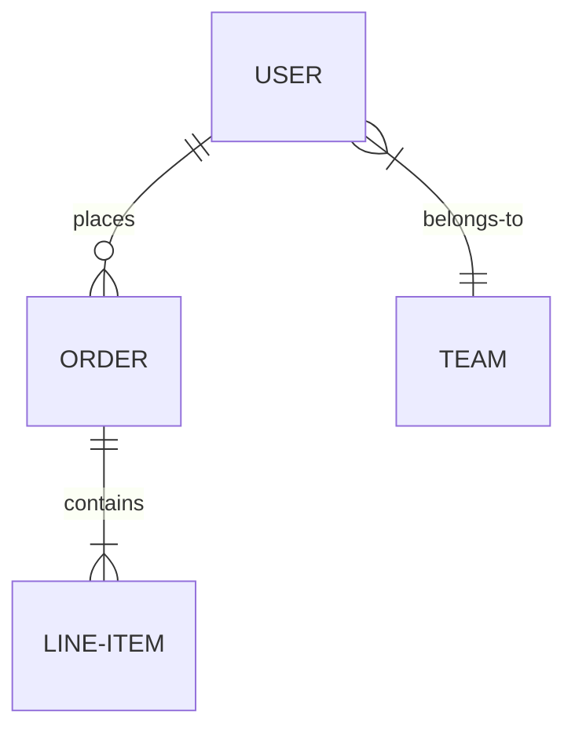

# Contracts: Entities, APIs, and Protocols

Define the contracts between architectural components. Contracts are what components agree to when they talk to each other: the data they exchange (entities and schemas), the interfaces they expose (APIs), the wire formats they use (protocols), and the async messages they emit (events).

This skill uses the floorplan's component inventory (COMP), block diagram edges (BD), data flows (DF), and swim-lane diagrams (SL) as its starting point. Each edge in the block diagram becomes an API or event contract. Each data flow becomes a set of entities with schemas. Each swim-lane becomes a choreography that the APIs must support.

Your sole output is the contracts document. You do not create tasks, write code, generate implementation plans, or perform any action other than producing or refining contracts.

<HARD-GATE>
Do NOT skip to writing output. Every entity, API, and protocol decision must be presented to the user for review and confirmation before recording. The complete contracts document must be reviewed before writing to disk.
</HARD-GATE>

## Checklist

You MUST create a task for each of these items and complete them in order:

1. **Discover inputs** — find PRD, floorplan, architecture docs, code, feature breakdowns, determine scope and output format
2. **Identify entities** — extract entities from PRD and floorplan data flows, interview user, present entity catalog for confirmation
3. **Design APIs and protocols** — walk each floorplan edge, decide protocol and API shape, interview user per boundary
4. **Define event contracts** — identify async boundaries from floorplan, define event schemas
5. **Validate & assess** — build traceability matrix, run validation rules, produce quality assessment
6. **Write output** — present complete contracts document for review, write to disk after approval

---

## Phase 0: Discover Inputs

### Search for existing documents

Search these locations:

| Document | Locations to check |
|----------|--------------------|
| **PRD** | `docs/prd.md`, `docs/prd.org`, `docs/prd/`, `docs/prds/` |
| **Floorplan** | `docs/floorplan.md`, `docs/floorplan.org` |
| **Architecture docs** | `docs/architecture.md`, `docs/architecture.org`, `docs/architecture/` |
| **Technology choices** | `docs/technology.md`, `docs/technology.org`, `docs/technology/` |
| **Feature PRDs** | `docs/features/` |
| **Existing contracts** | `docs/contracts.md`, `docs/contracts.org` |

Use Glob to check all locations. Read any documents found.

### If an existing contracts document is found:

- Load it and summarize its current state to the user
- Ask the user what they want to do: update existing contracts, extend with new ones, or start fresh

### Load feature index

Check for `docs/features/index.org` or `docs/features/index.md`. If found, load it — the index provides the epic/feature hierarchy, component-to-feature mappings, and dependency graph. This is sufficient for Phase 0 scoping decisions.

**Do NOT load individual feature PRDs at this point.** Feature PRDs are loaded on-demand in Phases 1–3 when their components come into scope during entity and API analysis.

The feature index helps contracts:
- Determine scope (system-wide vs feature-scoped)
- Prioritize inter-feature boundaries (which need the cleanest public APIs) over intra-feature boundaries (where tighter coupling is acceptable)
- Validate entity ownership alignment with feature boundaries in Phase 4

If no feature index exists, note to the user: "No feature index found. Consider running the prd-feature-breakdown skill first to define feature boundaries — this helps contracts prioritize which API boundaries need the cleanest interfaces."

### If no floorplan is found:

- Tell the user: "I couldn't find a floorplan. The floorplan's component inventory and diagrams are the primary input for contracts. I recommend running the floorplan skill first."
- Stop here unless the user provides direction

### If no PRD is found:

- Tell the user: "I couldn't find a PRD. I recommend starting with the prd-create skill."
- Stop here unless the user provides a PRD or points to one

### Scan the codebase for existing contracts

Existing code may already define entities, APIs, and protocols. Scan for:

**Entity/schema definitions:**
- ORM models, migration files, schema definitions
- TypeScript/Go/Rust type definitions in model directories
- Proto files (`*.proto`) — these define both entities and API contracts
- GraphQL schemas (`*.graphql`, `*.gql`)
- JSON Schema files (`*.schema.json`)
- OpenAPI/Swagger specs (`openapi.yaml`, `swagger.json`, `swagger.yaml`)
- Database migration directories

**API definitions:**
- Route/controller files (search for router, handler, controller, endpoint patterns)
- Proto service definitions
- GraphQL resolvers
- REST client/SDK files
- API test files (often reveal contract expectations)

**Protocol indicators:**
- gRPC proto files → gRPC over HTTP/2
- GraphQL schemas → GraphQL over HTTP
- REST route patterns → REST over HTTP
- WebSocket handlers → WebSocket
- Queue consumer/producer code → async messaging (identify broker: Redis, Kafka, RabbitMQ, SQS, etc.)
- Event handler registrations → event-driven patterns

Use Glob to find these files. Read the ones that exist and extract contract facts.

### Determine scope

Ask the user:

- **System-wide or feature-scoped?** "Should I define contracts for the entire system, or scope this to a specific feature?" If feature-scoped, identify which feature PRD and which subset of floorplan components are in scope.
- If feature-scoped, load the relevant feature PRD from `docs/features/` and filter the floorplan's component inventory to only the components involved in that feature.

### Determine output format

- Scan `docs/` for `.org` vs `.md` files (Glob for `docs/**/*.org` and `docs/**/*.md`)
- If org-mode files are present, output `docs/contracts.org`; otherwise output `docs/contracts.md`
- If feature-scoped, output `docs/features/<feature-name>-contracts.org` (or `.md`)
- Tell the user which format you'll use

### Present discovered context

Summarize what you found:
- "From the floorplan, I see these components and edges: [summary]"
- "From the codebase, I see these existing entities, APIs, and protocols: [summary]"
- "These existing definitions will be carried forward and extended."

---

## Phase 1: Identify Entities

Entities are the nouns of the system — the data objects that components create, read, update, delete, and exchange.

### Load feature PRDs on-demand

If running system-wide and a feature index exists, load individual feature PRDs as needed to understand which FRs and components are involved in entity identification. Load only the feature PRDs whose components are relevant to the current analysis — not all of them at once.

If running feature-scoped, load only the scoped feature's PRD from `docs/features/`.

### Extract entity candidates

From the inputs, identify entity candidates:

1. **From the PRD** — nouns in capabilities (CAP), functional requirements (FR), and user stories (UC/UJ). Examples: "user", "team", "invoice", "notification", "session."
2. **From the floorplan's data flows (DF)** — data annotations on edges name the entities that move through the system.
3. **From the floorplan's swim lanes (SL)** — message payloads in sequence diagrams reveal entity shapes.
4. **From existing code** — ORM models, proto messages, type definitions already define entities. These are carried forward, not reinvented.
5. **From architecture docs** — design rationale may explain entity relationships and constraints.

### Interview the user

For each entity candidate, ask targeted questions to fill gaps:

- **Identity**: What uniquely identifies this entity? (natural key, UUID, auto-increment, composite?)
- **Lifecycle**: Who creates it? Who reads it? Who updates it? Who deletes it? (maps to COMP identifiers from the floorplan)
- **Relationships**: What other entities does it reference? (one-to-one, one-to-many, many-to-many)
- **Constraints**: Are there invariants? (e.g., "an order must have at least one line item", "a user's email must be unique")
- **Sensitivity**: Does this entity contain PII, credentials, financial data, or other sensitive fields? Note for downstream security decisions.

**Use sensible defaults for obvious answers.** When an entity's identity, lifecycle, or relationships are clear from the PRD, floorplan, or existing code, state your assumption and move on — don't ask the user to confirm what's already evident. Only interview on genuinely ambiguous decisions (e.g., "Should user IDs be UUIDs or auto-increment?" when neither the PRD nor codebase establishes a convention).

Group questions — ask no more than 5-7 at a time. Prioritize questions that unblock the most entity definitions.

### Build the entity catalog

For each entity:

- **Identifier**: ENT1, ENT2, etc.
- **Name**: descriptive name (e.g., "User", "Order", "Session")
- **Attributes**: list of fields with types and constraints. Use language-agnostic types: `string`, `integer`, `boolean`, `timestamp`, `uuid`, `decimal`, `text`, `enum(values)`, `json`, `binary`, `reference(ENT_)`.
- **Primary key**: the identifying field(s)
- **Relationships**: references to other entities with cardinality
- **PRD provenance**: which CAP, FR, UC, UJ items require this entity
- **Floorplan provenance**: which COMP creates/owns it, which COMPs read/write it, which DF/SL diagrams it appears in
- **Code status**: "existing" (found in codebase — note the source file), "new", or "modified" (existing but needs changes)
- **Sensitivity**: PII, credentials, financial, or none

### Present the entity relationship diagram

Produce a Mermaid `erDiagram` showing all entities and their relationships.

### Present for confirmation

Show the entity catalog and ER diagram to the user. Ask them to confirm, add, remove, or adjust entities before proceeding.

<HARD-GATE>
Do NOT proceed to Phase 2 until the user has confirmed the entity catalog.
</HARD-GATE>

---

## Phase 2: Design APIs and Protocols

APIs are the verbs of the system — how components operate on entities. Protocols are the wire formats — how data is serialized and transmitted.

### Walk the floorplan edges

The floorplan's block diagram (BD) shows every component-to-component edge — each edge indicates that communication exists and describes its *nature* (e.g., "queries", "authenticates", "notifies"). Each edge (or cluster of related edges) becomes an API boundary that needs a contract.

For each edge or boundary:

1. **Decide the protocol** — the floorplan intentionally does not prescribe protocols. Use the technology choices doc, existing code, and architectural constraints to inform a recommendation, and interview the user to decide.
2. **Define the API operations** that cross this boundary
3. **Map operations to entities** from Phase 1

### Interview the user per boundary

For each component boundary, present the context and ask:

**Protocol decision:**
- If the technology choices doc specifies the protocol for this boundary, carry it forward.
- If existing code already uses a protocol for this boundary, carry it forward unless the user wants to change it.
- Otherwise, present 2-3 options with trade-offs grounded in the PRD's requirements and architectural constraints, and recommend one.
- Skip obvious implied decisions: choosing gRPC implies HTTP/2 and Protocol Buffers; choosing REST implies HTTP; choosing Kafka implies TCP. Only document the highest-relevant layer.

**API operations:**
- What operations does the calling component need? (informed by the floorplan's swim lanes — each SL message becomes an API call or event)
- What entities are sent and received? (reference ENT identifiers from Phase 1)
- What are the error cases? (not found, unauthorized, validation failure, conflict)

**Use sensible defaults for obvious decisions.** When the technology choices doc, existing code, or architectural constraints make the protocol choice clear, state it and move on. Only present options when there is a genuine trade-off to resolve.

Group related boundaries — ask no more than 3-4 decisions at a time.

### Build the API inventory

Organize APIs by component boundary (the edge between two COMPs). For each boundary:

- **Identifier**: API1, API2, etc.
- **Boundary**: which COMPs this API connects (e.g., "COMP1 → COMP3")
- **Protocol**: the wire protocol (REST/HTTP, gRPC, GraphQL, WebSocket, etc.)
- **Serialization**: the data format (JSON, Protocol Buffers, Avro, etc.) — only when non-obvious from the protocol choice

For each operation within a boundary:

- **Identifier**: API1.1, API1.2, etc.
- **Name**: descriptive (e.g., "Create User", "List Orders", "Authenticate")
- **Direction**: request/response, fire-and-forget, streaming
- **Request schema**: fields and types, referencing ENT identifiers where applicable
- **Response schema**: fields and types, referencing ENT identifiers
- **Error cases**: expected failure modes with error identifiers/codes
- **PRD provenance**: which FR, UC, or UJ items this operation supports
- **Floorplan provenance**: which SL diagram(s) include this operation
- **Idempotency**: whether the operation is idempotent, and if so, the idempotency mechanism
- **Authentication/authorization**: what auth is required (if applicable)

### Protocol decisions table

Summarize protocol choices in a table:

| Boundary | From | To | Protocol | Serialization | Rationale |
|----------|------|----|----------|---------------|-----------|
| API1 | COMP1 | COMP3 | gRPC | Protocol Buffers | Low-latency internal service communication |
| API2 | COMP1 | COMP2 | REST/HTTP | JSON | Public-facing API, broad client compatibility |

**Rules for protocol decisions:**

1. Only document the highest relevant protocol layer. Do not state TCP when HTTP is chosen — TCP is implied.
2. Do not document obvious serialization choices. gRPC implies Protocol Buffers. REST typically implies JSON — only note if it differs.
3. When the floorplan or technology doc already specifies the protocol, carry it forward without re-deciding.
4. When the existing codebase already uses a protocol for a boundary, carry it forward unless the user wants to change it.

### Present for confirmation

Show the API inventory and protocol decisions to the user. Walk through each boundary. Ask for confirmation before proceeding.

<HARD-GATE>
Do NOT proceed to Phase 3 until the user has confirmed the API inventory and protocol decisions.
</HARD-GATE>

---

## Phase 3: Define Event Contracts

Events are async messages emitted by one component and consumed by one or more others. Not every system has events — if the floorplan shows no async boundaries, skip this phase.

### Identify async boundaries

From the floorplan:
- Block diagram edges labeled with async mechanisms (events, messages, queues, pub/sub, webhooks)
- Data flow diagrams showing async paths (message queues, event streams)
- Swim-lane diagrams showing fire-and-forget or async notification patterns

From existing code:
- Queue producer/consumer patterns
- Event emitter/handler registrations
- Webhook dispatch/receive code

### Define event contracts

For each event:

- **Identifier**: EVT1, EVT2, etc.
- **Name**: descriptive (e.g., "UserCreated", "OrderShipped", "PaymentFailed")
- **Producer**: which COMP emits it
- **Consumers**: which COMPs listen for it
- **Trigger**: what causes the event (e.g., "emitted after a new user record is persisted")
- **Payload schema**: fields and types, referencing ENT identifiers
- **Delivery semantics**: at-most-once, at-least-once, exactly-once
- **Ordering guarantees**: ordered within a partition key, unordered, etc.
- **Transport**: the message broker or mechanism (Kafka topic, SQS queue, Redis pub/sub, webhook URL, etc.)
- **PRD provenance**: which FR, UC, or UJ items this event supports

### Present for confirmation

Show the event contracts to the user. Ask for confirmation before proceeding.

If no async boundaries exist, confirm with the user: "I see no async communication in the floorplan. Is that correct, or are there events I should define?"

<HARD-GATE>
Do NOT proceed to Phase 4 until the user has confirmed the event contracts (or confirmed that no events are needed).
</HARD-GATE>

---

## Phase 4: Validate & Assess

### Build the PRD Traceability Matrix

Map every PRD item to the contract elements that realize it:

| PRD Item | Type | Contract coverage |
|----------|------|-------------------|
| CAP1 | Capability | ENT1, ENT3; API1.1, API1.2; EVT1 |
| FR3 | Functional Req | ENT2; API2.3; EVT2 |
| UC2 | Use Case | API1.1 → API2.1 → EVT1 (see SL2) |

Every PRD item in scope must have at least one entry. Empty rows are validation failures.

### Build the Floorplan Traceability Matrix

Map every floorplan element to contract elements:

| Floorplan Element | Type | Contract coverage |
|-------------------|------|-------------------|
| COMP1 → COMP3 edge | BD edge | API1 (gRPC, 4 operations) |
| DF1.2 data path | Data flow | ENT1, ENT3 flow through API1.1, API2.3 |
| SL1 | Swim lane | API1.1 → API1.2 → EVT1 → API2.1 |

Every block diagram edge must map to at least one API or event contract. Every data flow must map to entities with schemas. Every swim-lane message must map to an API operation or event.

### Run validation rules

Evaluate the contracts against each rule below. For each rule, state pass or fail with a brief note.

#### Completeness rules

1. **Entity coverage** — Every data entity implied by the PRD's functional requirements has a schema definition (ENT identifier).
2. **API edge coverage** — Every synchronous edge in the floorplan's block diagram has an API contract (API identifier) with at least one operation.
3. **Event edge coverage** — Every async edge in the floorplan's block diagram has an event contract (EVT identifier).
4. **Swim-lane fidelity** — Every message in every floorplan swim-lane diagram maps to a specific API operation or event. No swim-lane messages are unaccounted for.
5. **Data flow fidelity** — Every data annotation in the floorplan's data flow diagrams maps to a defined entity (ENT identifier).
6. **CRUD completeness** — For each entity, the API operations cover the lifecycle implied by the PRD. If the PRD says users can be created and deleted, there must be create and delete operations.

#### Consistency rules

7. **Schema-API alignment** — Every API request/response schema references only defined entities (ENT identifiers). No inline, unnamed data shapes.
8. **Protocol-entity compatibility** — Serialization format can represent all entity field types. (e.g., Protocol Buffers can handle the types used; JSON can represent the precision needed for decimal fields.)
9. **Constraint compliance** — Every architectural constraint (AC) from the PRD is honored in the contracts. For each AC, state how.
10. **Non-goal boundary enforcement** — No API or event implements functionality listed as a non-goal (NG).
11. **Identifier namespace integrity** — All identifiers (ENT, API, EVT) are unique, follow the prefix convention, and do not collide with PRD identifiers (CAP, FR, UC, UJ, AC, G, NG, P) or floorplan identifiers (COMP, BD, DF, SL).

#### Coherence rules

12. **Entity-relationship consistency** — Relationships in the ER diagram match the foreign key / reference fields in entity schemas.
13. **Bidirectional edge consistency** — If COMP1 calls COMP2, the API contract defines operations from COMP1's perspective and COMP2's perspective consistently (request matches what COMP2 expects).
14. **Event producer-consumer consistency** — Every event has at least one consumer. Every consumer expects a payload that matches the producer's schema.

#### Feature-boundary alignment rules (if feature PRDs exist)

15. **Entity ownership alignment** — For each entity, the component(s) that create and manage it should belong to a single feature. Flag any entity whose owning components are split across multiple features — this is a split-ownership problem. Present it to the user: "ENT3 (Order) is created by COMP2 (in Feature A) but primarily managed by COMP5 (in Feature B). Consider designating a single owning feature or adjusting feature boundaries."
16. **Inter-feature API cleanliness** — API boundaries that cross feature boundaries should have well-defined, stable contracts. Flag any inter-feature API that has overly broad or tightly-coupled operations — these are candidates for refinement.

### Produce the Quality Assessment

Write the assessment as the final section of the contracts document. List each rule with its pass/fail status and a brief note. If any rule fails, note the gap and what would need to change to close it.

---

## Phase 5: Write Output

### Present the complete contracts document

Show the user the complete document for review. For large documents, present in sections rather than all at once:

1. Entity catalog and ER diagram
2. API contracts and protocol decisions
3. Event contracts
4. Traceability matrices and quality assessment

Ask for confirmation after each section. If the user has already reviewed and confirmed entities (Phase 1), APIs (Phase 2), and events (Phase 3) individually, present only the traceability matrices and quality assessment as new material — do not re-present sections the user has already approved.

<HARD-GATE>
Do NOT write to disk until the user has reviewed and approved the contracts document.
</HARD-GATE>

### Write to disk

- System-wide: write to `docs/contracts.org` (or `docs/contracts.md` based on Phase 0)
- Feature-scoped: write to `docs/features/<feature-name>-contracts.org` (or `.md`)

### Consolidation: feature-scoped to system-wide

If multiple feature-scoped contracts files already exist when running this skill:

- **System-wide run**: load existing feature-scoped contracts and consolidate them into the system-wide document. Deduplicate entities that appear in multiple feature contracts (same ENT, keep the richest definition). Merge API boundaries that overlap. After consolidation, the feature-scoped files can be kept as references or removed — ask the user.
- **Feature-scoped run**: check existing system-wide or feature-scoped contracts first. Reference shared entities by identifier rather than redefining them. Only define new entities and APIs specific to this feature.

### Suggest next steps

After writing, tell the user:
- "Your contracts are documented. Next steps you might consider:"
  - Run the bv-taskify skill to decompose features into implementation task hierarchies in br (beads) — contracts inform the task boundaries and acceptance criteria
  - Run the tech-plan skill to make technology decisions informed by these contracts
  - Review with your team — the traceability matrices make it easy to verify coverage

---

## Output Document Structure

### Org-mode template (`docs/contracts.org`):

```org
#+TITLE: Contracts
#+DATE: YYYY-MM-DD

* Overview

Brief summary of the contracts defined in this document.

PRD: [[file:prd.org][PRD]]
Floorplan: [[file:floorplan.org][Floorplan]]
Technology: [[file:technology.org][Technology Choices]] (if exists)
Scope: System-wide | Feature: <feature-name>

* Entity Catalog

** ENT1: User

- Primary key: =id= (uuid)
- PRD provenance: CAP1, FR1, FR2
- Floorplan provenance: COMP2 (owner), COMP3 (reader); DF1.1
- Code status: existing (=src/models/user.go=)
- Sensitivity: PII

| Field | Type | Constraints | Notes |
|-------+------+-------------+-------|
| id | uuid | PK, immutable | |
| email | string | unique, not null | PII |
| name | string | not null | PII |
| created_at | timestamp | not null, immutable | |
| team_id | reference(ENT2) | not null | FK to Team |

** ENT2: Team

...

* Entity Relationship Diagram

#+BEGIN_SRC mermaid
erDiagram
    USER ||--o{ ORDER : places
    USER }|--|| TEAM : belongs-to
    ORDER ||--|{ LINE-ITEM : contains
#+END_SRC

* API Contracts

** API1: COMP1 → COMP3 (Web App → API Gateway)

- Protocol: REST/HTTP
- Serialization: JSON
- Authentication: Bearer token

*** API1.1: Create user

- Direction: request/response
- PRD provenance: FR1, UC1.1
- Floorplan provenance: SL1 (step 2)
- Idempotency: idempotent (email as natural key)

Request:

| Field | Type | Required | Notes |
|-------+------+----------+-------|
| email | string | yes | Must be valid email |
| name | string | yes | |
| team_id | uuid | yes | Must reference existing ENT2 |

Response (success):

| Field | Type | Notes |
|-------+------+-------|
| id | uuid | Assigned by server |
| email | string | |
| name | string | |
| created_at | timestamp | |

Response (error):

| Code | Condition |
|------+-----------|
| 400 | Validation failure |
| 409 | Email already exists |

** API2: COMP3 → COMP4 (API Gateway → Auth Service)

...

* Protocol Decisions

| Boundary | From | To | Protocol | Serialization | Rationale |
|----------+------+----+----------+---------------+-----------|
| API1 | COMP1 | COMP3 | REST/HTTP | JSON | Public-facing, broad client support |
| API2 | COMP3 | COMP4 | gRPC | Protocol Buffers | Internal, low-latency |

* Event Contracts

** EVT1: UserCreated

- Producer: COMP3
- Consumers: COMP6, COMP7
- Trigger: after new user record is persisted
- Transport: Kafka topic =user-events=
- Delivery: at-least-once
- Ordering: ordered by user ID partition key
- PRD provenance: FR5

| Field | Type | Notes |
|-------+------+-------|
| user_id | uuid | References ENT1 |
| email | string | |
| created_at | timestamp | |

* PRD Traceability Matrix

| PRD Item | Type | Contract coverage |
|----------+------+-------------------|
| CAP1 | Capability | ENT1, ENT2; API1.1, API1.2; EVT1 |
| FR1 | Functional Req | ENT1; API1.1 |
| UC1 | Use Case | API1.1 → API2.1 → EVT1 (see SL1) |

* Floorplan Traceability Matrix

| Floorplan Element | Type | Contract coverage |
|-------------------+------+-------------------|
| COMP1 → COMP3 | BD edge | API1 (REST, 4 operations) |
| DF1.1 | Data flow | ENT1, ENT2 via API1.1, API1.2 |
| SL1 | Swim lane | API1.1 → API2.1 → EVT1 |

* Contracts Quality Assessment

| # | Rule | Status | Notes |
|---+------+--------+-------|
| 1 | Entity coverage | Pass | All data entities defined |
| 2 | API edge coverage | Pass | All sync edges have API contracts |
| 3 | Event edge coverage | Pass | All async edges have event contracts |
| 4 | Swim-lane fidelity | Pass | All SL messages mapped |
| 5 | Data flow fidelity | Pass | All DF annotations mapped |
| 6 | CRUD completeness | Pass | All entity lifecycles covered |
| 7 | Schema-API alignment | Pass | All schemas reference ENT IDs |
| 8 | Protocol-entity compatibility | Pass | Serialization formats compatible |
| 9 | Constraint compliance | Pass | AC1: honored by ... |
| 10 | Non-goal boundary | Pass | No NG items implemented |
| 11 | Identifier namespace integrity | Pass | No collisions |
| 12 | ER consistency | Pass | ER diagram matches schemas |
| 13 | Bidirectional edge consistency | Pass | Request/response shapes match |
| 14 | Event producer-consumer consistency | Pass | All events have consumers |
| 15 | Entity ownership alignment | Pass | Each entity owned by a single feature |
| 16 | Inter-feature API cleanliness | Pass | Inter-feature APIs are well-scoped |
```

### Markdown template (`docs/contracts.md`):

```markdown
# Contracts

**PRD:** [PRD](prd.md)
**Floorplan:** [Floorplan](floorplan.md)
**Technology:** [Technology Choices](technology.md) (if exists)
**Date:** YYYY-MM-DD
**Scope:** System-wide | Feature: <feature-name>

## Overview

Brief summary of the contracts defined in this document.

## Entity Catalog

### ENT1: User

- **Primary key:** `id` (uuid)
- **PRD provenance:** CAP1, FR1, FR2
- **Floorplan provenance:** COMP2 (owner), COMP3 (reader); DF1.1
- **Code status:** existing (`src/models/user.go`)
- **Sensitivity:** PII

| Field | Type | Constraints | Notes |
|-------|------|-------------|-------|
| id | uuid | PK, immutable | |
| email | string | unique, not null | PII |
| name | string | not null | PII |
| created_at | timestamp | not null, immutable | |
| team_id | reference(ENT2) | not null | FK to Team |

### ENT2: Team

...

## Entity Relationship Diagram



## API Contracts

### API1: COMP1 → COMP3 (Web App → API Gateway)

- **Protocol:** REST/HTTP
- **Serialization:** JSON
- **Authentication:** Bearer token

#### API1.1: Create user

- **Direction:** request/response
- **PRD provenance:** FR1, UC1.1
- **Floorplan provenance:** SL1 (step 2)
- **Idempotency:** idempotent (email as natural key)

**Request:**

| Field | Type | Required | Notes |
|-------|------|----------|-------|
| email | string | yes | Must be valid email |
| name | string | yes | |
| team_id | uuid | yes | Must reference existing ENT2 |

**Response (success):**

| Field | Type | Notes |
|-------|------|-------|
| id | uuid | Assigned by server |
| email | string | |
| name | string | |
| created_at | timestamp | |

**Response (error):**

| Code | Condition |
|------|-----------|
| 400 | Validation failure |
| 409 | Email already exists |

### API2: COMP3 → COMP4 (API Gateway → Auth Service)

...

## Protocol Decisions

| Boundary | From | To | Protocol | Serialization | Rationale |
|----------|------|----|----------|---------------|-----------|
| API1 | COMP1 | COMP3 | REST/HTTP | JSON | Public-facing, broad client support |
| API2 | COMP3 | COMP4 | gRPC | Protocol Buffers | Internal, low-latency |

## Event Contracts

### EVT1: UserCreated

- **Producer:** COMP3
- **Consumers:** COMP6, COMP7
- **Trigger:** after new user record is persisted
- **Transport:** Kafka topic `user-events`
- **Delivery:** at-least-once
- **Ordering:** ordered by user ID partition key
- **PRD provenance:** FR5

| Field | Type | Notes |
|-------|------|-------|
| user_id | uuid | References ENT1 |
| email | string | |
| created_at | timestamp | |

## PRD Traceability Matrix

| PRD Item | Type | Contract coverage |
|----------|------|-------------------|
| CAP1 | Capability | ENT1, ENT2; API1.1, API1.2; EVT1 |
| FR1 | Functional Req | ENT1; API1.1 |
| UC1 | Use Case | API1.1 → API2.1 → EVT1 (see SL1) |

## Floorplan Traceability Matrix

| Floorplan Element | Type | Contract coverage |
|-------------------|------|-------------------|
| COMP1 → COMP3 | BD edge | API1 (REST, 4 operations) |
| DF1.1 | Data flow | ENT1, ENT2 via API1.1, API1.2 |
| SL1 | Swim lane | API1.1 → API2.1 → EVT1 |

## Contracts Quality Assessment

| # | Rule | Status | Notes |
|---|------|--------|-------|
| 1 | Entity coverage | Pass | All data entities defined |
| 2 | API edge coverage | Pass | All sync edges have API contracts |
| 3 | Event edge coverage | Pass | All async edges have event contracts |
| 4 | Swim-lane fidelity | Pass | All SL messages mapped |
| 5 | Data flow fidelity | Pass | All DF annotations mapped |
| 6 | CRUD completeness | Pass | All entity lifecycles covered |
| 7 | Schema-API alignment | Pass | All schemas reference ENT IDs |
| 8 | Protocol-entity compatibility | Pass | Serialization formats compatible |
| 9 | Constraint compliance | Pass | AC1: honored by ... |
| 10 | Non-goal boundary | Pass | No NG items implemented |
| 11 | Identifier namespace integrity | Pass | No collisions |
| 12 | ER consistency | Pass | ER diagram matches schemas |
| 13 | Bidirectional edge consistency | Pass | Request/response shapes match |
| 14 | Event producer-consumer consistency | Pass | All events have consumers |
| 15 | Entity ownership alignment | Pass | Each entity owned by a single feature |
| 16 | Inter-feature API cleanliness | Pass | Inter-feature APIs are well-scoped |
```

---

## Identifier Reference Guide

Contract identifiers live alongside (but do not collide with) PRD and floorplan identifiers. All are globally unique within the project.

| Entity | Prefix | Example | Notes |
|--------|--------|---------|-------|
| Entity/schema | ENT | ENT1, ENT2 | Data objects with field-level schemas |
| API boundary | API | API1, API2 | One per component-to-component boundary |
| API operation | API | API1.1, API1.2 | Dot notation for operations within a boundary |
| Event | EVT | EVT1, EVT2 | Async messages between components |

**PRD identifiers (do not reuse):** CAP, P, UC, UJ, FR, G, NG, AC

**Floorplan identifiers (do not reuse):** COMP, BD, DF, SL

---

## Important Constraints

- Your ONLY output is the contracts document (or interview questions when gathering context)
- Do NOT create implementation code, migration files, proto files, or OpenAPI specs — this is a design document, not generated code
- Do NOT invent requirements — if the PRD doesn't specify something, note the gap in the quality assessment rather than filling it with assumptions
- When updating existing contracts, preserve entity and API identifiers that are still valid
- When feature-scoped, do not redefine entities or APIs already defined in the system-wide contracts — reference them by identifier and extend only what is new
- Prefer precision over verbosity in all descriptions
- Schema field types must be language-agnostic: use `string`, `integer`, `boolean`, `timestamp`, `uuid`, `decimal`, `text`, `enum(values)`, `json`, `binary`, `reference(ENT_)`
